class: middle, center, title-slide

# Deep Learning

Lecture 1: Fundamentals of machine learning

  
Prof. Gilles Louppe 
[g.louppe@uliege.be](g.louppe@uliege.be)

???

R: P(X,Y) or density p(x,y)?
R: cleanup code

---

# Today

Set the fundamentals of machine learning.

- Why learning?
- Applications and success
- Statistical learning
    - Supervised learning
    - Empirical risk minimization
    - Under-fitting and over-fitting
    - Bias-variance dilemma

---

class: middle

# Why learning?

---

class: middle, center

.width-80[]

What do you see?

.italic[How do we do that?!]

---

class: middle

.center[
.width-70[]

Sheepdog or mop?
]

.footnote[Credits: [Karen Zack](https://twitter.com/teenybiscuit), 2016.]

---

class: middle

.center[
.width-70[]

Chihuahua or muffin?
]

.footnote[Credits: [Karen Zack](https://twitter.com/teenybiscuit). 2016.]

---

class: middle

The automatic extraction of **semantic information** from raw signal is at the
core of many applications, such as
- image recognition
- speech processing
- natural language processing
- robotic control
- ... and many others.

How can we *write a computer program* that implements that?

---

class: middle

The (human) brain is so good at interpreting visual information that the **gap** between raw
data and its semantic interpretation is difficult to assess intuitively:

 
.center[

This is a mushroom.
]

---

class: middle, center

.width-70[]

This is a mushroom.

---

class: middle, center

.width-30[] +
.width-30[] +
.width-30[]

This is a mushroom.

---

class: middle, center

.width-80[]

This is a mushroom.

---

class: middle

Extracting semantic information requires models of **high complexity**, which cannot be designed by hand.

However, one can write a program that *learns* the task of extracting semantic information.

Techniques used in practice consist of:
- defining a parametric model with high capacity,
- optimizing its parameters, by "making it work" on the training data.

.footnote[Credits: Francois Fleuret, [EE559 Deep Learning](https://fleuret.org/ee559/), EPFL.]

---

class: middle

This is similar to *biological systems* for which the model (e.g., brain structure) is
DNA-encoded, and parameters (e.g., synaptic weights) are tuned through
experiences.

Deep learning encompasses software technologies to **scale-up** to billions of
model parameters and as many training examples.

.footnote[Credits: Francois Fleuret, [EE559 Deep Learning](https://fleuret.org/ee559/), EPFL.]

---

class: middle

# Applications and success

---

class: middle, center, black-slide

<iframe width="600" height="450" src="https://www.youtube.com/embed/MPU2HistivI" frameborder="0" allowfullscreen></iframe>

Real-time object detection (Redmon and Farhadi, 2018)

---

class: middle, center, black-slide

<iframe width="600" height="450" src="https://www.youtube.com/embed/qWl9idsCuLQ" frameborder="0" allowfullscreen></iframe>

Segmentation (Hengshuang et al, 2017)

---

class: middle, center, black-slide

<iframe width="600" height="450" src="https://www.youtube.com/embed/pW6nZXeWlGM" frameborder="0" allowfullscreen></iframe>

Pose estimation (Cao et al, 2017)

---

class: middle, center, black-slide

<iframe width="600" height="450" src="https://www.youtube.com/embed/V1eYniJ0Rnk" frameborder="0" allowfullscreen></iframe>

Reinforcement learning (Mnih et al, 2014)

---

class: middle, center, black-slide

<iframe width="600" height="450" src="https://www.youtube.com/embed/HcZ48JDamyk" frameborder="0" allowfullscreen></iframe>

Strategy games (Deepmind, 2016-2018)

---

class: middle, center, black-slide

<iframe width="600" height="450" src="https://www.youtube.com/embed/qhUvQiKec2U" frameborder="0" allowfullscreen></iframe>

Autonomous cars (NVIDIA, 2016)

---

class: middle, center, black-slide

<iframe width="600" height="450" src="https://www.youtube.com/embed/Nu-nlQqFCKg?start=471" frameborder="0" allowfullscreen></iframe>

Speech recognition, translation and synthesis (Microsoft, 2012)

---

class: middle, center, black-slide

<iframe width="600" height="450" src="https://www.youtube.com/embed/8BFzu9m52sc" frameborder="0" allowfullscreen></iframe>

Auto-captioning (2015)

---

class: middle, center, black-slide

<iframe width="600" height="450" src="https://www.youtube.com/embed/7gh6_U7Nfjs" frameborder="0" allowfullscreen></iframe>

Speech synthesis and question answering (Google, 2018)

---

class: middle, center, black-slide

<iframe width="600" height="450" src="https://www.youtube.com/embed/kSLJriaOumA" frameborder="0" allowfullscreen></iframe>

Image generation (Karras et al, 2018)

---

class: middle, center, black-slide

<iframe width="600" height="450" src="https://www.youtube.com/embed/egJ0PTKQp4U?start=223" frameborder="0" allowfullscreen></iframe>

Music composition (NVIDIA, 2017)

---

# Why does it work now?

.center.grid[
.kol-1-2[
New algorithms  
.width-90[]
]
.center.kol-1-2[
More data  
.width-50[]
]
]

.center.grid[
.kol-1-2[
Software 
.width-90[]
]
.kol-1-2[
Faster compute engines  
.width-50[]
]
]

---

class: middle

## Building on the shoulders of giants

Five decades of research in machine learning provided
- a taxonomy of ML concepts (classification, generative models, clustering, kernels, linear embeddings, etc.),
- a sound statistical formalization (Bayesian estimation, PAC),
- a clear picture of fundamental issues (bias/variance dilemma, VC
dimension, generalization bounds, etc.),
- a good understanding of optimization issues,
- efficient large-scale algorithms.

.footnote[Credits: Francois Fleuret, [EE559 Deep Learning](https://fleuret.org/ee559/), EPFL.]

---

class: middle

## Deep learning

From a practical perspective, deep learning
- lessens the need for a deep mathematical grasp,
- makes the design of large learning architectures a system/software development task,
- allows to leverage modern hardware (clusters of GPUs),
- does not plateau when using more data,
- makes large trained networks a commodity.

.footnote[Credits: Francois Fleuret, [EE559 Deep Learning](https://fleuret.org/ee559/), EPFL.]

---

class: middle

.center.width-70[]

.footnote[Credits: Francois Fleuret, [EE559 Deep Learning](https://fleuret.org/ee559/), EPFL.]

???

Same story for storage, which allows for larger dataset.

---

class: middle

.center.width-90[]

.footnote[Image credits: Canziani et al, 2016, arXiv:[1605.07678](https://arxiv.org/abs/1605.07678).]

---

class: middle

# Statistical learning

---

# Supervised learning

Consider an unknown joint probability distribution $P(X,Y)$.

Assume training data
$$(\mathbf{x}\_i,y\_i) \sim P(X,Y),$$
with $\mathbf{x}\_i \in \mathcal{X}$, $y\_i \in \mathcal{Y}$, $i=1, ..., N$.

- In most cases,
    - $\mathbf{x}\_i$ is a $p$-dimensional vector of features or descriptors,
    - $y\_i$ is a scalar (e.g., a category or a real value).
- The training data is generated i.i.d.
- The training data can be of any finite size $N$.
- In general, we do not have any prior information about $P(X,Y)$.

???

In most cases, x is a vector, but it could be an image, a piece of text or a sample of sound.

---

class: middle

## Inference

Supervised learning is usually concerned with the two following inference problems:
- **Classification**:
Given $(\mathbf{x}\_i, y\_i) \in \mathcal{X}\times\mathcal{Y} = \mathbb{R}^p \times \\\{1, ..., C\\\}$, for $i=1, ..., N$,
we want to estimate for any new $\mathbf{x}$, $$\arg \max\_y P(Y=y|X=\mathbf{x}).$$
- **Regression**:
Given $(\mathbf{x}\_i, y\_i) \in \mathcal{X}\times\mathcal{Y} =  \mathbb{R}^p \times \mathbb{R}$, for $i=1, ..., N$,
we want to estimate for any new $\mathbf{x}$, $$\mathbb{E}\left[ Y|X=\mathbf{x} \right].$$

---

class: middle

Or more generally, inference is concerned with the conditional estimation
$$P(Y=y|X=\mathbf{x})$$
for any new $(\mathbf{x},y)$.

---

class: middle, center

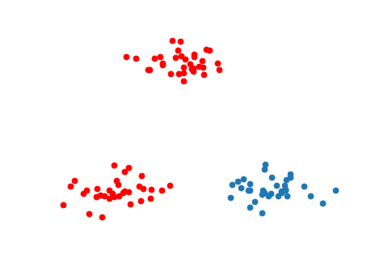

Classification consists in identifying 
a decision boundary between objects of distinct classes.

---

class: middle, center

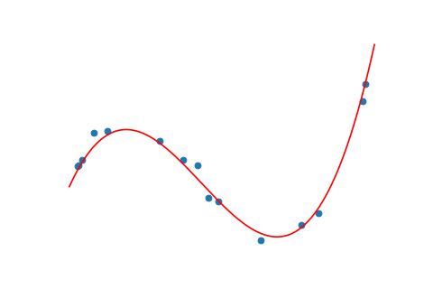

Regression aims at estimating relationships among (usually continuous) variables.

---

# Empirical risk minimization

Consider a function $f : \mathcal{X} \to \mathcal{Y}$ produced by some learning algorithm. The predictions
of this function can be evaluated through a loss
$$\ell : \mathcal{Y} \times  \mathcal{Y} \to \mathbb{R},$$
such that $\ell(y, f(\mathbf{x})) \geq 0$ measures how close the prediction $f(\mathbf{x})$ from $y$ is.

 
## Examples of loss functions

.grid[
.kol-1-3[Classification:]
.kol-2-3[$\ell(y,f(\mathbf{x})) = \mathbf{1}\_{y \neq f(\mathbf{x})}$]
]
.grid[
.kol-1-3[Regression:]
.kol-2-3[$\ell(y,f(\mathbf{x})) = (y - f(\mathbf{x}))^2$]
]

---

class: middle

Let $\mathcal{F}$ denote the hypothesis space, i.e. the set of all functions $f$ than can be produced by the chosen learning algorithm.

We are looking for a function $f \in \mathcal{F}$ with a small **expected risk** (or generalization error)
$$R(f) = \mathbb{E}\_{(\mathbf{x},y)\sim P(X,Y)}\left[ \ell(y, f(\mathbf{x})) \right].$$

This means that for a given data generating distribution $P(X,Y)$ and for a given hypothesis space $\mathcal{F}$,
the optimal model is
$$f\_\* = \arg \min\_{f \in \mathcal{F}} R(f).$$

---

class: middle

Unfortunately, since $P(X,Y)$ is unknown, the expected risk cannot be evaluated and the optimal
model cannot be determined.

However, if we have i.i.d. training data $\mathbf{d} = \\\{(\mathbf{x}\_i, y\_i) | i=1,\ldots,N\\\}$, we can
compute an estimate, the **empirical risk** (or training error)
$$\hat{R}(f, \mathbf{d}) = \frac{1}{N} \sum\_{(\mathbf{x}\_i, y\_i) \in \mathbf{d}} \ell(y\_i, f(\mathbf{x}\_i)).$$

This estimate is *unbiased* and can be used for finding a good enough approximation of $f\_\*$. This results into the **empirical risk minimization principle**:
$$f\_\*^{\mathbf{d}} = \arg \min\_{f \in \mathcal{F}} \hat{R}(f, \mathbf{d})$$

???

What does unbiased mean?

=> The expected empirical risk estimate (over d) is the expected risk.

---

class: middle

Most machine learning algorithms, including **neural networks**, implement empirical risk minimization.

Under regularity assumptions, empirical risk minimizers converge:

$$\lim\_{N \to \infty} f\_\*^{\mathbf{d}} = f\_\*$$

???

This is why tuning the parameters of the model to make it work on the training data is a reasonable thing to do.

---

# Polynomial regression

.center[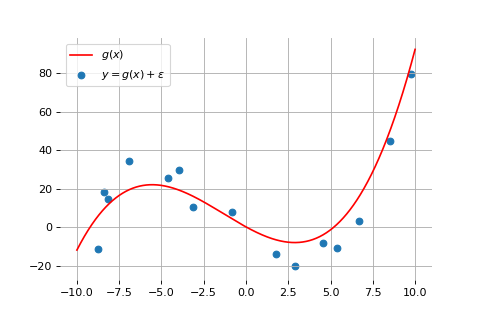]

Consider the joint probability distribution $P(X,Y)$ induced by the data generating
process
$$(x,y) \sim P(X,Y) \Leftrightarrow x \sim U[-10;10], \epsilon \sim \mathcal{N}(0, \sigma^2), y = g(x) + \epsilon$$
where $x \in \mathbb{R}$, $y\in\mathbb{R}$ and $g$ is an unknown polynomial of degree 3.

---

class: middle

Our goal is to find a function $f$ that makes good predictions on average over $P(X,Y)$.

Consider the hypothesis space $f \in \mathcal{F}$ of polynomials of degree 3 defined through their parameters $\mathbf{w} \in \mathbb{R}^4$ such that
$$\hat{y} \triangleq f(x; \mathbf{w}) = \sum\_{d=0}^3 w\_d x^d$$  

---

class: middle

For this regression problem, we use the squared error loss
$$\ell(y, f(x;\mathbf{w})) = (y - f(x;\mathbf{w}))^2$$
to measure how wrong the predictions are.

Therefore, our goal is to find the best value $\mathbf{w}\_\*$ such
$$\begin{aligned}
\mathbf{w}\_\* &= \arg\min\_\mathbf{w} R(\mathbf{w}) \\\\
&= \arg\min\_\mathbf{w}  \mathbb{E}\_{(x,y)\sim P(X,Y)}\left[ (y-f(x;\mathbf{w}))^2 \right]
\end{aligned}$$

---

class: middle

Given a large enough training set $\mathbf{d} = \\\{(x\_i, y\_i) | i=1,\ldots,N\\\}$, the
empirical risk minimization principle tells us that a good estimate $\mathbf{w}\_\*^{\mathbf{d}}$ of $\mathbf{w}\_\*$ can be found by minimizing the empirical risk:
$$\begin{aligned}
\mathbf{w}\_\*^{\mathbf{d}} &= \arg\min\_\mathbf{w} \hat{R}(\mathbf{w},\mathbf{d}) \\\\
&= \arg\min\_\mathbf{w} \frac{1}{N}  \sum\_{(x\_i, y\_i) \in \mathbf{d}} (y\_i - f(x\_i;\mathbf{w}))^2 \\\\
&= \arg\min\_\mathbf{w} \frac{1}{N}  \sum\_{(x\_i, y\_i) \in \mathbf{d}} (y\_i - \sum\_{d=0}^3 w\_d x\_i^d)^2 \\\\
&= \arg\min\_\mathbf{w} \frac{1}{N} \left\lVert
\underbrace{\begin{pmatrix}
y\_1 \\\\
y\_2 \\\\
\ldots \\\\
y\_N
\end{pmatrix}}\_{\mathbf{y}} -
\underbrace{\begin{pmatrix}
x\_1^0 \ldots x\_1^3 \\\\
x\_2^0 \ldots x\_2^3 \\\\
\ldots \\\\
x\_N^0 \ldots x\_N^3
\end{pmatrix}}\_{\mathbf{X}}
\begin{pmatrix}
w\_0 \\\\
w\_1 \\\\
w\_2 \\\\
w\_3
\end{pmatrix}
\right\rVert^2
\end{aligned}$$

---

class: middle

This is **ordinary least squares** regression, for which the solution is known analytically:
$$\mathbf{w}\_\*^{\mathbf{d}} = (\mathbf{X}^T\mathbf{X})^{-1}\mathbf{X}^T\mathbf{y}$$

.center[]

---

class: middle

The expected risk minimizer $\mathbf{w}\_\*$ within our hypothesis space is $g$ itself.

Therefore, on this toy problem, we can verify that
$f(x;\mathbf{w}\_\*^{\mathbf{d}}) \to f(x;\mathbf{w}\_\*) = g(x)$ as $N \to \infty$.

---

class: middle

.center[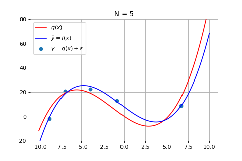]

---

class: middle
count: false

.center[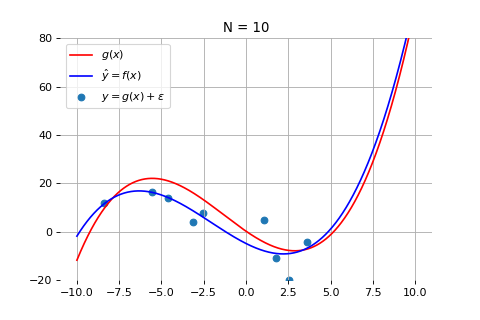]

---

class: middle
count: false

.center[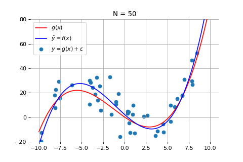]

---

class: middle
count: false

.center[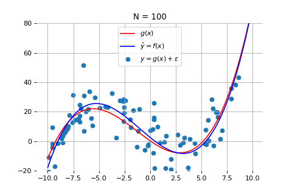]

---

class: middle
count: false

.center[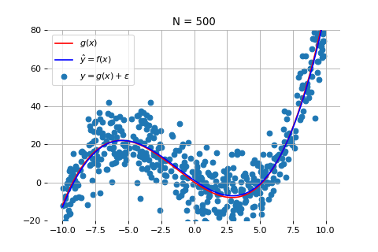]

---

# Under-fitting and over-fitting

What if we consider a hypothesis space $\mathcal{F}$ in which candidate functions $f$ are either too "simple" or too "complex" with respect to the true data generating process?

---

class: middle

.center[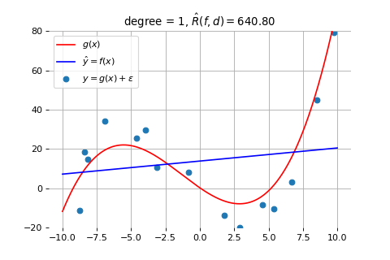]

.center[$\mathcal{F}$ = polynomials of degree 1]

---

class: middle
count: false

.center[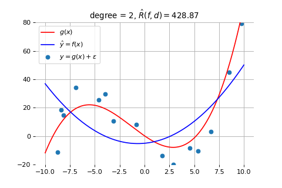]

.center[$\mathcal{F}$ = polynomials of degree 2]

---

class: middle
count: false

.center[]

.center[$\mathcal{F}$ = polynomials of degree 3]

---

class: middle
count: false

.center[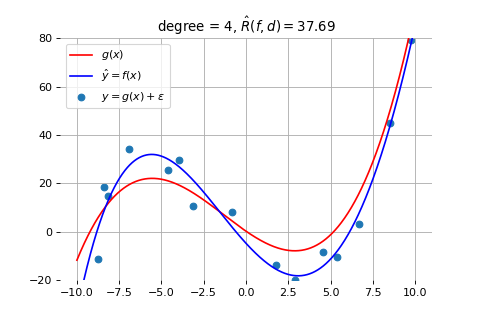]

.center[$\mathcal{F}$ = polynomials of degree 4]

---

class: middle
count: false

.center[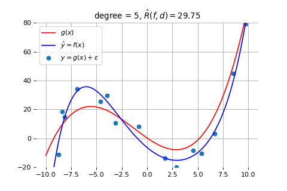]

.center[$\mathcal{F}$ = polynomials of degree 5]

---

class: middle
count: false

.center[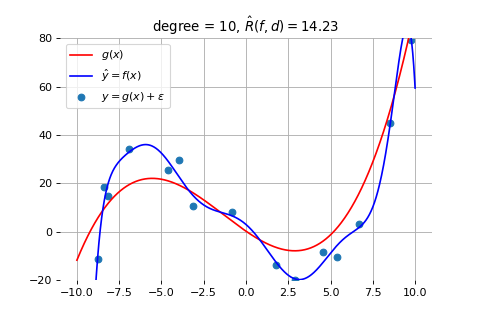]

.center[$\mathcal{F}$ = polynomials of degree 10]

---

class: middle, center

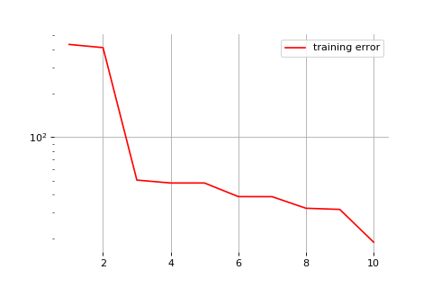

Degree $d$ of the polynomial VS. error.

???

Why shouldn't we pick the largest $d$?

---

class: middle

Let $\mathcal{Y}^{\mathcal X}$ be the set of all functions $f : \mathcal{X} \to \mathcal{Y}$.

We define the **Bayes risk** as the minimal expected risk over all possible functions,
$$R\_B = \min\_{f \in \mathcal{Y}^{\mathcal X}} R(f),$$
and call **Bayes model** the model $f_B$ that achieves this minimum.

No model $f$ can perform better than $f\_B$.

---

class: middle

The **capacity** of an hypothesis space induced by a learning algorithm intuitively represents the ability to
find a good model $f \in \mathcal{F}$ for any function, regardless of its complexity.

In practice, capacity can be controlled through hyper-parameters of the learning algorithm. For example:
- The degree of the family of polynomials;
- The number of layers in a neural network;
- The number of training iterations;
- Regularization terms.

---

class: middle

- If the capacity of $\mathcal{F}$ is too low, then $f\_B \notin \mathcal{F}$ and $R(f) - R\_B$ is large for any $f \in \mathcal{F}$, including $f\_\*$ and $f\_\*^{\mathbf{d}}$. Such models $f$ are said to **underfit** the data.
- If the capacity of $\mathcal{F}$  is too high, then $f\_B \in \mathcal{F}$ or $R(f\_\*) - R\_B$ is small. 
However, because of the high capacity of the hypothesis space, the empirical risk minimizer $f\_\*^{\mathbf{d}}$ could fit the training data arbitrarily well such that $$R(f\_\*^{\mathbf{d}}) \geq R\_B \geq \hat{R}(f\_\*^{\mathbf{d}}, \mathbf{d}) \geq 0.$$
In this situation, $f\_\*^{\mathbf{d}}$ becomes too specialized with respect to the true data generating process and a large reduction of the empirical risk (often) comes at the price
of an increase of the  expected risk of the empirical risk minimizer $R(f\_\*^{\mathbf{d}})$.
In this situation, $f\_\*^{\mathbf{d}}$ is said to **overfit** the data.

---

class: middle

Therefore, our goal is to adjust the capacity of the hypothesis space such that
the expected risk of the empirical risk minimizer gets as low as possible.

.center[]

???

Comment that for deep networks, training error may goes to 0 while the generalization error may not necessarily go up!

---

class: middle

When overfitting,
$$R(f\_\*^{\mathbf{d}}) \geq R\_B \geq \hat{R}(f\_\*^{\mathbf{d}}, \mathbf{d}) \geq 0.$$

This indicates that the empirical risk $\hat{R}(f\_\*^{\mathbf{d}}, \mathbf{d})$ is a poor estimator of the expected risk $R(f\_\*^{\mathbf{d}})$.

Nevertheless, an unbiased estimate of the expected risk can be obtained by evaluating $f\_\*^{\mathbf{d}}$ on data $\mathbf{d}\_\text{test}$ independent from the training samples $\mathbf{d}$:
$$\hat{R}(f\_\*^{\mathbf{d}}, \mathbf{d}\_\text{test}) =  \frac{1}{N} \sum\_{(\mathbf{x}\_i, y\_i) \in \mathbf{d}\_\text{test}} \ell(y\_i, f\_\*^{\mathbf{d}}(\mathbf{x}\_i))$$

This **test error** estimate can be used to evaluate the actual performance of the model. However, it should not be used, at the same time, for model selection.

---

class: middle, center

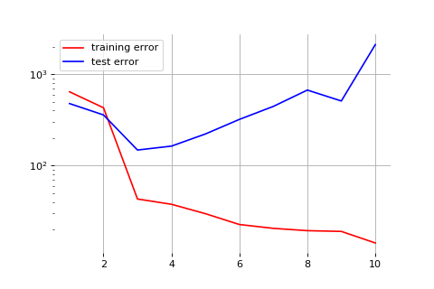

Degree $d$ of the polynomial VS. error.

???

What value of $d$ shall you select?

But then how good is this selected model?

---

class: middle

## (Proper) evaluation protocol

.center[]

There may be over-fitting, but it does not bias the final performance evaluation.

.footnote[Credits: Francois Fleuret, [EE559 Deep Learning](https://fleuret.org/ee559/), EPFL.]

---

class: middle

.center[]

.center[This should be **avoided** at all costs!]

.footnote[Credits: Francois Fleuret, [EE559 Deep Learning](https://fleuret.org/ee559/), EPFL.]

---

class: middle

.center[]

.center[Instead, keep a separate validation set for tuning the hyper-parameters.]

.footnote[Credits: Francois Fleuret, [EE559 Deep Learning](https://fleuret.org/ee559/), EPFL.]

???

Comment on the comparison of algorithms from one paper to the other.

---

# Bias-variance decomposition

Consider a fixed point $x$ and the prediction $\hat{Y}=f\_*^\mathbf{d}(x)$ of the empirical risk minimizer at $x$.

Then the local expected risk of $f\_\*^{\mathbf{d}}$ is
$$\begin{aligned}
R(f\_\*^{\mathbf{d}}|x) &= \mathbb{E}\_{y \sim P(Y|x)} \left[ (y - f\_\*^{\mathbf{d}}(x))^2 \right] \\\\
&= \mathbb{E}\_{y \sim P(Y|x)} \left[ (y - f\_B(x) + f\_B(x) - f\_\*^{\mathbf{d}}(x))^2 \right]  \\\\
&= \mathbb{E}\_{y \sim P(Y|x)} \left[ (y - f\_B(x))^2 \right] + \mathbb{E}\_{y \sim P(Y|x)} \left[ (f\_B(x) - f\_\*^{\mathbf{d}}(x))^2 \right] \\\\
&= R(f\_B|x) + (f\_B(x) - f\_\*^{\mathbf{d}}(x))^2
\end{aligned}$$
where
- $R(f\_B|x)$ is the local expected risk of the Bayes model. This term cannot be reduced.
- $(f\_B(x) - f\_\*^{\mathbf{d}}(x))^2$ represents the discrepancy between $f\_B$ and $f\_\*^{\mathbf{d}}$.

---

class: middle

If $\mathbf{d} \sim P(X,Y)$ is itself considered as a random variable, then $f\_*^\mathbf{d}$ is also a random variable, along with its predictions $\hat{Y}$.

---

class: middle

.center[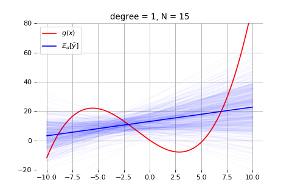]

???

What do you observe?

---

class: middle
count: false

.center[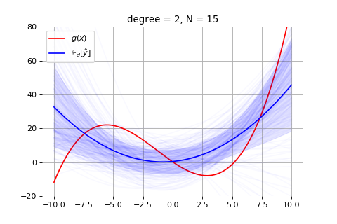]

---

class: middle
count: false

.center[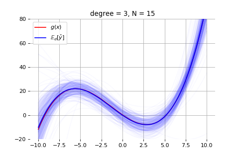]

---

class: middle
count: false

.center[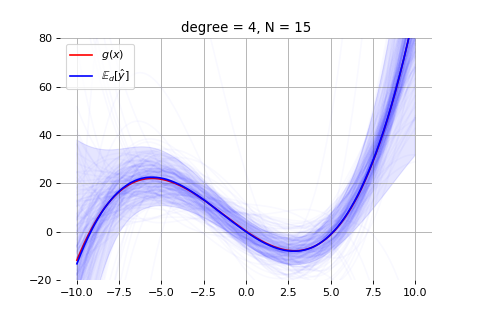]

---

class: middle
count: false

.center[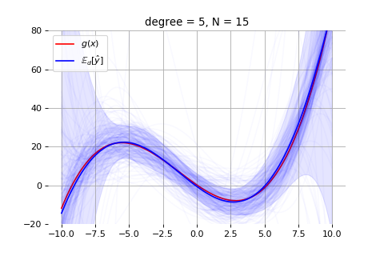]

---

class: middle

Formally, the expected local expected risk yields to:
$$\begin{aligned}
&\mathbb{E}\_\mathbf{d} \left[ R(f\_\*^{\mathbf{d}}|x) \right] \\\\
&= \mathbb{E}\_\mathbf{d} \left[ R(f\_B|x) + (f\_B(x) - f\_\*^{\mathbf{d}}(x))^2 \right]  \\\\
&=  R(f\_B|x) + \mathbb{E}\_\mathbf{d} \left[ (f\_B(x) - f\_\*^{\mathbf{d}}(x))^2 \right] \\\\
&= \underbrace{R(f\_B|x)}\_{\text{noise}(x)} + \underbrace{(f\_B(x) - \mathbb{E}\_\mathbf{d}\left[ f\_\*^\mathbf{d}(x) \right] )^2}\_{\text{bias}^2(x)}  + \underbrace{\mathbb{E}\_\mathbf{d}\left[ ( \mathbb{E}\_\mathbf{d}\left[ f\_\*^\mathbf{d}(x) \right] - f\_\*^\mathbf{d}(x))^2 \right]}\_{\text{var}(x)}
\end{aligned}$$

This decomposition is known as the **bias-variance** decomposition.
- The noise term quantities the irreducible part of the expected risk.
- The bias term measures the discrepancy between the average model and the Bayes model.
- The variance term quantities the variability of the predictions.

---

class: middle

## Bias-variance trade-off

- Reducing the capacity makes $f\_\*^\mathbf{d}$ fit the data less on average, which increases the bias term.
- Increasing the capacity makes $f\_\*^\mathbf{d}$ vary a lot with the training data, which increases the variance term.

.footnote[Credits: Francois Fleuret, [EE559 Deep Learning](https://fleuret.org/ee559/), EPFL.]

---

class: end-slide, center
count: false

The end.

---

# References

- Vapnik, V. (1992). Principles of risk minimization for learning theory. In Advances in neural information processing systems (pp. 831-838).
- Louppe, G. (2014). Understanding random forests: From theory to practice. arXiv preprint arXiv:1407.7502.
