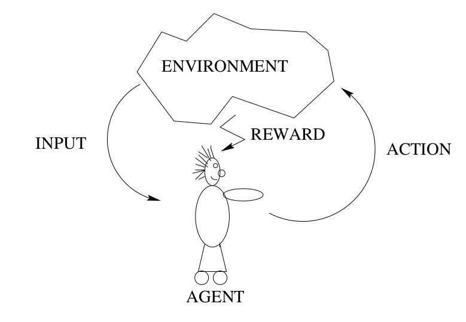

class: middle, center, title-slide

# Deep Learning

Lecture 10: Deep reinforcement learning

  
Guest lecture by Matthia Sabatelli 
[m.sabatelli@uliege.be](mailto:m.sabatelli@uliege.be )

---

# Today

Understand the field of Reinforcement Learning (RL) and see how it can be combined with neural networks.

- Markov Decision Processes (MDPs)
- Value functions and optimal policies
- Temporal Difference Learning
- Function approximators
- Tutorial
---

class: middle

# Reinforcement Learning

---

# Markov Decision Processes

A classical formalization when it comes to sequential decision making problems. They allow us to mathematically define RL problems for which **precise** and **sound** statements can be made.

An MDP consists of the following elements
- A set of possible states $\mathcal{S}$
- A set of possible actions $\mathcal{A}$
- A reward signal $R(s_t,a_t,s_{t+1})$
- A transition probability distribution $p(s_{t+1}|s_t,a_t)$

---
## Markov Decision Processes

In addition to these elements we have the **Agent-Environment Interface**.

The agent corresponds to the learner, sometimes also defined as the decision maker, which has the ability to **continually** interact with the environment.

Each time an action is performed the environment has the ability to change and will present **new** situations to the agent.

---

.center.width-40[]
.footnote

---
## Markov Decision Processes

Differently from Supervised-Learning in RL we have to deal with the component of **time**: in case no conditions are specified we could even let an agent interact with an environment forever.

Specifically the agent and the environment interact at each of a sequence of **discrete** time-steps

$$t=0,1,2,3, . . ..$$

At each time step $t$ the agent receives a state representation $s_t$, selects an action $a_t$, and receives a numerical reward $r_t \in \mathcal{R} \subset \mathbb{R}$ after which it will find itself in a new state $s_{t+1}$.

This gives rise to *trajectories*:
$$s_t, a_t, r_t, s_{t+1}, ... $$

---

## Markov Decision Processes

Some important properties of MDPs

- $s$ and $a$ at time-step $t$ give all the **necessary** information that is required for predicting to which state the agent will step next
- The reward that is obtained is only determined by the **previous** action and not by the history of all previously taken actions.

$$p(r_t = R|s_t,a_t) = p(r_t = R| s_t, a_t, ..., s_1, a_1)$$

For predicting the future it does not matter how an agent arrived in a particular current state.

---
## Goals and Returns

So far we have properly defined how an agent can interact with an environment but have not seen **why*+1* this should be done.

- The purpose of an RL agent is formalized by $r_t \in \mathcal{R} \subset \mathbb{R}$, which is a numerical quantity that we want to **maximize**

- We do not want to maximize the immediate reward but rather the cumulative reward

$$G_t = r_t + r_{t+1} + r_{t+2} + ... + r_{T} $$

- Mathematically this can be seen as maximizing the expected value of the cumulative sum of a scalar signal

---
## Goals and Returns

To properly define the concept of return we need one additional component: the discount factor $\gamma$.

The idea of *discounting* allows our agent to select actions which will maximize the sum of **discounted** rewards, therefore maximizing the discounted return:

$$G_t=r_t+\gamma r_{t+1}, \gamma^{2} r_{t+2} + ... $$
$$G_t = \sum_{k-0}^{\infty}\gamma^{k}r_{t+k+1}.$$  

The discount factor $0\leq \gamma \leq 1$ and controls the trade-off between immediate and long-term rewards.

---

## Policies and Value Functions

Basically all RL algorithms involve the concept of **value function**, functions that are able to estimate how *good* or *bad* it is for an agent to be in a particular state.

  - The *goodness* of a state is defined in terms of future rewards that can be expected by being in state $s$.
  - Just being in a *good* state is not enough, since the rewards will depend on which actions will be performed in the future. We need the concept of **policy**:
  $$\pi: \mathcal{S} \rightarrow \mathcal{A} $$

RL methods specify how the agent's policy is changed as a result of its experience.

---

## Policies and Value Functions

When it comes to value functions there are two popular value functions we care about

- The **state-value** function:  
  $$V^{\pi}(s)=\mathbb{E}\bigg[\sum_{k=0}^{\infty}\gamma^{k}r_{t+k}\bigg| s_t = s, \pi \bigg]$$
- The **state-action** value function:
$$ Q^{\pi}(s,a)=\mathbb{E}\bigg[\sum_{k=0}^{\infty}\gamma^{k}r_{t+k} \bigg| s_t = s, a_t=a, \pi\bigg].$$

---
## Policies and Value Functions

Both value functions can compute the desirability of being in a specific state. The goal of a RL agent is to find
an **optimal policy** that realizes the optimal expected return

$$V^* (s)=\underset{\pi}{\max}\:V^{\pi}(s), \ \text{for all} \ s\in\mathcal{S}$$

and the optimal state-action value function
$$ Q^* (s,a)= \underset{\pi}{\max}\:Q^{\pi}(s,a) \ \text{for all} \ s\in\mathcal{S} \ \text{and} \ a \in\mathcal{A}$$

Both value functions satisfy the **Bellman optimality equation**, and can be learned via Temporal-Difference or Monte-Carlo learning methods.

---
## Policies and Value Functions

We have seen how to define value functions mathematically but what do they represent in practice?

- We can see value functions as some sort of **knowledge** representation of an agent
- If a value functions is accurate an agent will know everything he needs to know for interacting with an environment
- The environment is **unknown** so we do not have any prior which can help us out
- We can only interact and update

---

class: middle

# Deep Reinforcement Learning

---

Coucou

---

class: end-slide, center
count: false

The end.

---

count: false

# References
