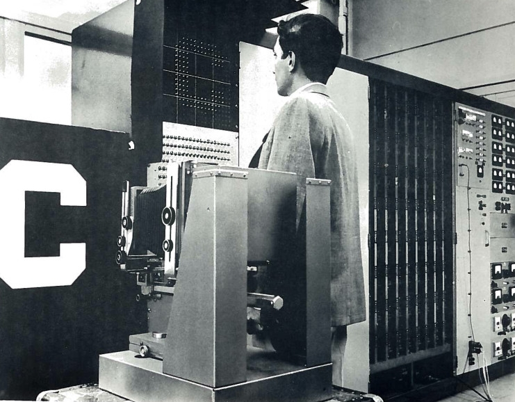
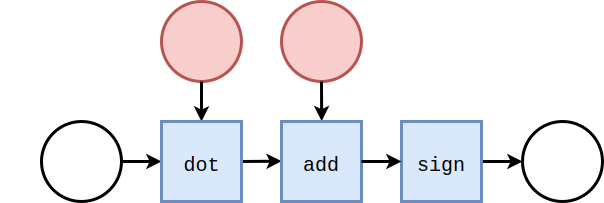
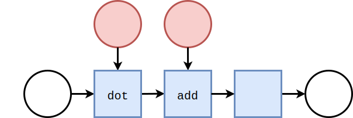

class: middle, center, title-slide

# Deep Learning

Lecture 2: Neural networks

  
Prof. Gilles Louppe 
[g.louppe@uliege.be](g.louppe@uliege.be)

---

# Today

Explain and motivate the basic constructs of neural networks.

- From linear discriminant analysis to logistic regression
- Stochastic gradient descent
- From logistic regression to the multi-layer perceptron
- Vanishing gradients and rectified networks

---

class: middle

# Neural networks

---

# Perceptron

The perceptron (Rosenblatt, 1957) is a simple mathematical model of a neuron:

$$f(\mathbf{x}) = \begin{cases}
   1 &\text{if } \sum_i w_i x_i + b \geq 0  \\\\
   0 &\text{otherwise}
\end{cases}$$

This model was originally motivated by biology, with $w_i$ being synaptic weights and $x_i$ and $f$ firing rates.

---

class: middle, center, black-slide

.grid[
.kol-1-2[.width-100[]]
.kol-1-2[  .width-100[]]
]

The Mark I Percetron (Frank Rosenblatt).

---

class: middle

Let us define the (non-linear) **activation** function:

$$\text{sign}(x) = \begin{cases}
   1 &\text{if } x \geq 0  \\\\
   0 &\text{otherwise}
\end{cases}$$
.center[]

The perceptron classification rule can be rewritten as
$$f(\mathbf{x}) = \text{sign}(\sum\_i w\_i x\_i  + b).$$

---

class: middle

In terms of **tensor operations**, $f$ can be rewritten as
$$f(\mathbf{x}) = \text{sign}(\mathbf{w}^T  \mathbf{x} + b),$$
for which the corresponding *computational graph* of $f$ is:

.center.width-70[]

---

# Linear discriminant analysis

Consider training data $(\mathbf{x}, y) \sim P(X,Y)$, with
- $\mathbf{x} \in \mathbb{R}^p$,
- $y \in \\\{0,1\\\}$.

Assume class populations are Gaussian, with same covariance matrix $\Sigma$ (homoscedasticity):

$$P(\mathbf{x}|y) = \frac{1}{\sqrt{(2\pi)^p |\Sigma|}} \exp \left(-\frac{1}{2}(\mathbf{x} - \mathbf{\mu}_y)^T \Sigma^{-1}(\mathbf{x} - \mathbf{\mu}_y) \right)$$

---

 
Using the Bayes' rule, we have:

$$\begin{aligned}
P(Y=1|\mathbf{x}) &= \frac{P(\mathbf{x}|Y=1) P(Y=1)}{P(\mathbf{x})} \\\\
         &= \frac{P(\mathbf{x}|Y=1) P(Y=1)}{P(\mathbf{x}|Y=0)P(Y=0) + P(\mathbf{x}|Y=1)P(Y=1)} \\\\
         &= \frac{1}{1 + \frac{P(\mathbf{x}|Y=0)P(Y=0)}{P(\mathbf{x}|Y=1)P(Y=1)}}.
\end{aligned}$$

--

count: false

It follows that with

$$\sigma(x) = \frac{1}{1 + \exp(-x)},$$

we get

$$P(Y=1|\mathbf{x}) = \sigma\left(\log \frac{P(\mathbf{x}|Y=1)}{P(\mathbf{x}|Y=0)} + \log \frac{P(Y=1)}{P(Y=0)}\right).$$

---

class: middle

Therefore,

$$\begin{aligned}
&P(Y=1|\mathbf{x}) \\\\
&= \sigma\left(\log \frac{P(\mathbf{x}|Y=1)}{P(\mathbf{x}|Y=0)} + \underbrace{\log \frac{P(Y=1)}{P(Y=0)}}\_{a}\right) \\\\
    &= \sigma\left(\log P(\mathbf{x}|Y=1) - \log P(\mathbf{x}|Y=0) + a\right) \\\\
    &= \sigma\left(-\frac{1}{2}(\mathbf{x} - \mathbf{\mu}\_1)^T \Sigma^{-1}(\mathbf{x} - \mathbf{\mu}\_1) + \frac{1}{2}(\mathbf{x} - \mathbf{\mu}\_0)^T \Sigma^{-1}(\mathbf{x} - \mathbf{\mu}\_0) + a\right) \\\\
    &= \sigma\left(\underbrace{(\mu\_1-\mu\_0)^T \Sigma^{-1}}\_{\mathbf{w}^T}\mathbf{x} + \underbrace{\frac{1}{2}(\mu\_0^T \Sigma^{-1} \mu\_0 - \mu\_1^T \Sigma^{-1} \mu\_1) + a}\_{b} \right) \\\\
    &= \sigma\left(\mathbf{w}^T \mathbf{x} + b\right)
\end{aligned}$$

---

class: middle, center

.width-100[]

---

count: false
class: middle, center

.width-100[]

---

count: false
class: middle, center

.width-100[]

---

class: middle

Note that the **sigmoid** function
$$\sigma(x) = \frac{1}{1 + \exp(-x)}$$
looks like a soft heavyside:

.center[]

Therefore, the overall model
$f(\mathbf{x};\mathbf{w},b) =  \sigma(\mathbf{w}^T \mathbf{x} + b)$
is very similar to the perceptron.

---

class: middle, center

.center.width-70[]

This unit is the **lego brick** of all neural networks!

---

# Logistic regression

Same model $$P(Y=1|\mathbf{x}) = \sigma\left(\mathbf{w}^T \mathbf{x} + b\right)$$ as for linear discriminant analysis.

But,
- **ignore** model assumptions (Gaussian class populations, homoscedasticity);
- instead, find $\mathbf{w}, b$ that maximizes the likelihood of the data.

---

class: middle

We have,

$$\begin{aligned}
&\arg \max\_{\mathbf{w},b} P(\mathbf{d}|\mathbf{w},b) \\\\
&= \arg \max\_{\mathbf{w},b} \prod\_{\mathbf{x}\_i, y\_i \in \mathbf{d}} P(Y=y\_i|\mathbf{x}\_i, \mathbf{w},b) \\\\
&= \arg \max\_{\mathbf{w},b} \prod\_{\mathbf{x}\_i, y\_i \in \mathbf{d}} \sigma(\mathbf{w}^T \mathbf{x}\_i + b)^{y\_i}  (1-\sigma(\mathbf{w}^T \mathbf{x}\_i + b))^{1-y\_i}  \\\\
&= \arg \min\_{\mathbf{w},b} \underbrace{\sum\_{\mathbf{x}\_i, y\_i \in \mathbf{d}} -{y\_i} \log\sigma(\mathbf{w}^T \mathbf{x}\_i + b) - {(1-y\_i)} \log (1-\sigma(\mathbf{w}^T \mathbf{x}\_i + b))}\_{\mathcal{L}(\mathbf{w}, b) = \sum\_i \ell(y\_i, \hat{y}(\mathbf{x}\_i; \mathbf{w}, b))}
\end{aligned}$$

This loss is an instance of the **cross-entropy** $$H(p,q) = \mathbb{E}_p[-\log q]$$ for  $p=Y|\mathbf{x}\_i$ and $q=\hat{Y}|\mathbf{x}\_i$.

???

- In general, the cross-entropy and the logistic losses do not admit a minimizer that can be expressed analytically in closed form.
- However, a minimizer can be found numerically, using a general minimization technique such as **gradient descent**.

---

# Gradient descent

Let $\mathcal{L}(\theta)$ denote a loss function defined over model parameters $\theta$ (e.g., $\mathbf{w}$ and $b$).

To minimize $\mathcal{L}(\theta)$, **gradient descent** uses local linear information to iteratively move towards a (local) minimum.

For $\theta\_0 \in \mathbb{R}^d$, a first-order approximation around $\theta\_0$ can be defined as
$$\hat{\mathcal{L}}(\theta\_0 + \epsilon) = \mathcal{L}(\theta\_0) + \epsilon^T\nabla\_\theta \mathcal{L}(\theta\_0) + \frac{1}{2\gamma}||\epsilon||^2.$$

.center.width-60[]

---

class: middle

A minimizer of the approximation $\hat{\mathcal{L}}(\theta\_0 + \epsilon)$ is given for
$$\begin{aligned}
\nabla\_\epsilon \hat{\mathcal{L}}(\theta\_0 + \epsilon) &= 0 \\\\
 &= \nabla\_\theta \mathcal{L}(\theta\_0) + \frac{1}{\gamma} \epsilon,
\end{aligned}$$
which results in the best improvement for the step $\epsilon = -\gamma \nabla\_\theta \mathcal{L}(\theta\_0)$.

Therefore, model parameters can be updated iteratively using the update rule
$$\theta\_{t+1} = \theta\_t -\gamma \nabla\_\theta \mathcal{L}(\theta\_t),$$
where
- $\theta_0$ are the initial parameters of the model;
- $\gamma$ is the **learning rate**;
- both are critical for the convergence of the update rule.

---

class: center, middle

Example 1: Convergence to a local minima

---

count: false
class: center, middle

Example 1: Convergence to a local minima

---

count: false
class: center, middle

Example 1: Convergence to a local minima

---

count: false
class: center, middle

Example 1: Convergence to a local minima

---

count: false
class: center, middle

Example 1: Convergence to a local minima

---

count: false
class: center, middle

Example 1: Convergence to a local minima

---

count: false
class: center, middle

Example 1: Convergence to a local minima

---

count: false
class: center, middle

Example 1: Convergence to a local minima

---

class: center, middle

Example 2: Convergence to the global minima

---

count: false
class: center, middle

Example 2: Convergence to the global minima

---

count: false
class: center, middle

Example 2: Convergence to the global minima

---

count: false
class: center, middle

Example 2: Convergence to the global minima

---

count: false
class: center, middle

Example 2: Convergence to the global minima

---

count: false
class: center, middle

Example 2: Convergence to the global minima

---

count: false
class: center, middle

Example 2: Convergence to the global minima

---

count: false
class: center, middle

Example 2: Convergence to the global minima

---

class: center, middle

Example 3: Divergence due to a too large learning rate

---

count: false
class: center, middle

Example 3: Divergence due to a too large learning rate

---

count: false
class: center, middle

Example 3: Divergence due to a too large learning rate

---

count: false
class: center, middle

Example 3: Divergence due to a too large learning rate

---

count: false
class: center, middle

Example 3: Divergence due to a too large learning rate

---

count: false
class: center, middle

Example 3: Divergence due to a too large learning rate

---

# Stochastic gradient descent

In the empirical risk minimization setup, $\mathcal{L}(\theta)$ and its gradient decompose as
$$\begin{aligned}
\mathcal{L}(\theta) &= \frac{1}{N} \sum\_{\mathbf{x}\_i, y\_i \in \mathbf{d}} \ell(y\_i, f(\mathbf{x}\_i; \theta)) \\\\
\nabla \mathcal{L}(\theta) &= \frac{1}{N} \sum\_{\mathbf{x}\_i, y\_i \in \mathbf{d}} \nabla \ell(y\_i, f(\mathbf{x}\_i; \theta)).
\end{aligned}$$
Therefore, in **batch** gradient descent the complexity of an update grows linearly with the size $N$ of the dataset.

More importantly, since the empirical risk is already an approximation of the expected risk, it should not be necessary to carry out the minimization with great accuracy.

---

  

Instead, **stochastic** gradient descent uses as update rule:
$$\theta\_{t+1} = \theta\_t - \gamma \nabla \ell(y\_{i(t+1)}, f(\mathbf{x}\_{i(t+1)}; \theta\_t))$$

- Iteration complexity is independent of $N$.
- The stochastic process $\\\{ \theta\_t | t=1, ... \\\}$ depends on the examples $i(t)$ picked randomly at each iteration.

.grid.center.italic[
.kol-1-2[.width-100[]

Batch gradient descent]
.kol-1-2[.width-100[]

Stochastic gradient descent
]
]

---

class: middle

When decomposing the excess error in terms of approximation, estimation and optimization errors,
stochastic algorithms yield the best generalization performance (in terms of **expected** risk) despite being
the worst optimization algorithms (in terms of *empirical risk*) (Bottou, 2011).

$$\begin{aligned}
&\mathbb{E}\left[ R(\tilde{f}\_\*^\mathbf{d}) - R(f\_B) \right] \\\\
&= \mathbb{E}\left[ R(f\_\*) - R(f\_B) \right] + \mathbb{E}\left[ R(f\_\*^\mathbf{d}) - R(f\_\*) \right] + \mathbb{E}\left[ R(\tilde{f}\_\*^\mathbf{d}) - R(f\_\*^\mathbf{d}) \right]  \\\\
&= \mathcal{E}\_\text{app} + \mathcal{E}\_\text{est} + \mathcal{E}\_\text{opt}
\end{aligned}$$

---

# Layers

So far we considered the logistic unit $h=\sigma\left(\mathbf{w}^T \mathbf{x} + b\right)$, where $h \in \mathbb{R}$, $\mathbf{x} \in \mathbb{R}^p$, $\mathbf{w} \in \mathbb{R}^p$ and $b \in \mathbb{R}$.

These units can be composed *in parallel* to form a **layer** with $q$ outputs:
$$\mathbf{h} = \sigma(\mathbf{W}^T \mathbf{x} + \mathbf{b})$$
where  $\mathbf{h} \in \mathbb{R}^q$, $\mathbf{x} \in \mathbb{R}^p$, $\mathbf{W} \in \mathbb{R}^{p\times q}$, $b \in \mathbb{R}^q$ and where $\sigma(\cdot)$ is upgraded to the element-wise sigmoid function.

 
.center.width-70[]

---

# Multi-layer perceptron

Similarly, layers can be composed *in series*, such that:
$$\begin{aligned}
\mathbf{h}\_0 &= \mathbf{x} \\\\
\mathbf{h}\_1 &= \sigma(\mathbf{W}\_1^T \mathbf{h}\_0 + \mathbf{b}\_1) \\\\
... \\\\
\mathbf{h}\_L &= \sigma(\mathbf{W}\_L^T \mathbf{h}\_{L-1} + \mathbf{b}\_L) \\\\
f(\mathbf{x}; \theta) = \hat{y} &= \mathbf{h}\_L
\end{aligned}$$
where $\theta$ denotes the model parameters $\\{ \mathbf{W}\_k, \mathbf{b}\_k, ... | k=1, ..., L\\}$.

This model is the **multi-layer perceptron**, also known as the fully connected feedforward network.

---

class: middle, center

.width-100[]

---

class: middle

## Classification

- For binary classification, the width $q$ of the last layer $L$ is set to $1$, which results in a single output $h\_L \in [0,1]$ that models the probability $P(Y=1|\mathbf{x})$.
- For multi-class classification, the sigmoid action $\sigma$ in the last layer can be generalized to produce a (normalized) vector $\mathbf{h}\_L \in [0,1]^C$ of probability estimates $P(Y=i|\mathbf{x})$.
  
This activation is the $\text{Softmax}$ function, where its $i$-th output is defined as
$$\text{Softmax}(\mathbf{z})\_i = \frac{\exp(z\_i)}{\sum\_{j=1}^C \exp(z\_j)},$$
for $i=1, ..., C$.

---

class: middle

## Regression

The last activation $\sigma$ can be skipped to produce unbounded output values $h\_L \in \mathbb{R}$.

---

# Automatic differentiation

To minimize $\mathcal{L}(\theta)$ with stochastic gradient descent, we need the gradient $\nabla_\theta \mathcal{\ell}(\theta_t)$.

Therefore, we require the evaluation of the (total) derivatives
$$\frac{\text{d} \ell}{\text{d} \mathbf{W}\_k},  \frac{\text{d} \mathcal{\ell}}{\text{d} \mathbf{b}\_k}$$
of the loss $\ell$ with respect to all model parameters $\mathbf{W}\_k$, $\mathbf{b}\_k$, for $k=1, ..., L$.

These derivatives can be evaluated automatically from the *computational graph* of $\ell$ using **automatic differentiation**.

---

class: middle

## Chain rule

The **chain rule** states that $(f \circ g)' = (f' \circ g) g'.$

For the total derivative, the chain rule generalizes to
$$
\begin{aligned}
\frac{\text{d} y}{\text{d} x} &= \sum\_{k=1}^m \frac{\partial y}{\partial u\_k} \underbrace{\frac{\text{d} u\_k}{\text{d} x}}\_{\text{recursive case}}
\end{aligned}$$

---

class: middle

## Reverse automatic differentiation

- Since a neural network is a **composition of differentiable functions**, the total
derivatives of the loss can be evaluated backward, by applying the chain rule
recursively over its computational graph.
- The implementation of this procedure is called reverse *automatic differentiation*.

---

class: middle

Let us consider a simplified 2-layer MLP and the following loss function:
$$\begin{aligned}
f(\mathbf{x}; \mathbf{W}\_1, \mathbf{W}\_2) &= \sigma\left( \mathbf{W}\_2^T \sigma\left( \mathbf{W}\_1^T \mathbf{x} \right)\right) \\\\
\mathcal{\ell}(y, \hat{y}; \mathbf{W}\_1, \mathbf{W}\_2) &= \text{cross\\\_ent}(y, \hat{y}) + \lambda \left( ||\mathbf{W}_1||\_2 + ||\mathbf{W}\_2||\_2 \right)
\end{aligned}$$
for $\mathbf{x} \in \mathbb{R^p}$, $y \in \mathbb{R}$, $\mathbf{W}\_1 \in \mathbb{R}^{p \times q}$ and $\mathbf{W}\_2 \in \mathbb{R}^q$.

---

class: middle

In the *forward pass*, intermediate values are all computed from inputs to outputs, which results in the annotated computational graph below:

.width-100[]

---

class: middle

The total derivative can be computed through a **backward pass**, by walking through all paths from outputs to parameters in the computational graph and accumulating the terms. For example, for $\frac{\text{d} \ell}{\text{d} \mathbf{W}\_1}$  we have:
$$\begin{aligned}
\frac{\text{d} \ell}{\text{d} \mathbf{W}\_1} &= \frac{\partial \ell}{\partial u\_8}\frac{\text{d} u\_8}{\text{d} \mathbf{W}\_1} + \frac{\partial \ell}{\partial u\_4}\frac{\text{d} u\_4}{\text{d} \mathbf{W}\_1} \\\\
\frac{\text{d} u\_8}{\text{d} \mathbf{W}\_1} &= ...
\end{aligned}$$

.width-100[]

---

class: middle

.width-100[]

Let us zoom in on the computation of the network output $\hat{y}$ and of its derivative with respect to $\mathbf{W}\_1$.

- *Forward pass*: values $u\_1$, $u\_2$, $u\_3$ and $\hat{y}$ are computed by traversing the graph from inputs to outputs given $\mathbf{x}$, $\mathbf{W}\_1$ and $\mathbf{W}\_2$.
- **Backward pass**: by the chain rule we have
$$\begin{aligned}
\frac{\text{d} \hat{y}}{\text{d} \mathbf{W}\_1} &= \frac{\partial \hat{y}}{\partial u\_3} \frac{\partial u\_3}{\partial u\_2} \frac{\partial u\_2}{\partial u\_1} \frac{\partial u\_1}{\partial \mathbf{W}\_1} \\\\
&= \frac{\partial \sigma(u\_3)}{\partial u\_3} \frac{\partial \mathbf{W}\_2^T u\_2}{\partial u\_2} \frac{\partial \sigma(u\_1)}{\partial u\_1} \frac{\partial \mathbf{W}\_1^T u\_1}{\partial \mathbf{W}\_1}
\end{aligned}$$
Note how evaluating the partial derivatives requires the intermediate values computed forward.

---

class: middle

- This algorithm is also known as **backpropagation**.
- An equivalent procedure can be defined to evaluate the derivatives in *forward mode*, from inputs to outputs.
- Since differentiation is a linear operator, automatic differentiation can be implemented efficiently in terms of tensor operations.

---

# Vanishing gradients

Training deep MLPs with many layers has for long (pre-2011) been very difficult due to the **vanishing gradient** problem.
- Small gradients slow down, and eventually block, stochastic gradient descent.
- This results in a limited capacity of learning.

.width-100[]
.caption[Backpropagated gradients normalized histograms (Glorot and Bengio, 2010).  Gradients for layers far from the output vanish to zero. ]

---

class: middle

Let us consider a simplified 3-layer MLP, with $x, w\_1, w\_2, w\_3 \in\mathbb{R}$, such that
$$f(x; w\_1, w\_2, w\_3) = \sigma\left(w\_3\sigma\left( w\_2 \sigma\left( w\_1 x \right)\right)\right). $$

Under the hood, this would be evaluated as
$$\begin{aligned}
u\_1 &= w\_1 x \\\\
u\_2 &= \sigma(u\_1) \\\\
u\_3 &= w\_2 u\_2 \\\\
u\_4 &= \sigma(u\_3) \\\\
u\_5 &= w\_3 u\_4 \\\\
\hat{y} &= \sigma(u\_5)
\end{aligned}$$
and its derivative $\frac{\text{d}\hat{y}}{\text{d}w\_1}$ as
$$\begin{aligned}\frac{\text{d}\hat{y}}{\text{d}w\_1} &= \frac{\partial \hat{y}}{\partial u\_5} \frac{\partial u\_5}{\partial u\_4} \frac{\partial u\_4}{\partial u\_3} \frac{\partial u\_3}{\partial u\_2}\frac{\partial u\_2}{\partial u\_1}\frac{\partial u\_1}{\partial w\_1}\\\\
&= \frac{\partial \sigma(u\_5)}{\partial u\_5} w\_3 \frac{\partial \sigma(u\_3)}{\partial u\_3} w\_2 \frac{\partial \sigma(u\_1)}{\partial u\_1} x
\end{aligned}$$

---

class: middle

The derivative of the sigmoid activation function $\sigma$ is:

.center[]

$$\frac{\text{d} \sigma}{\text{d} x}(x) = \sigma(x)(1-\sigma(x))$$

Notice that $0 \leq \frac{\text{d} \sigma}{\text{d} x}(x) \leq \frac{1}{4}$ for all $x$.

---

class: middle

Assume that weights $w\_1, w\_2, w\_3$ are initialized randomly from a Gaussian with zero-mean and  small variance, such that with high probability $-1 \leq w\_i \leq 1$.

Then,

$$\frac{\text{d}\hat{y}}{\text{d}w\_1} = \underbrace{\frac{\partial \sigma(u\_5)}{\partial u\_5}}\_{\leq \frac{1}{4}} \underbrace{w\_3}\_{\leq 1} \underbrace{\frac{\partial \sigma(u\_3)}{\partial u\_3}}\_{\leq \frac{1}{4}} \underbrace{w\_2}\_{\leq 1} \underbrace{\frac{\sigma(u\_1)}{\partial u\_1}}\_{\leq \frac{1}{4}} x$$

This implies that the gradient $\frac{\text{d}\hat{y}}{\text{d}w\_1}$ **exponentially** shrinks to zero as the number of layers in the network increases.

Hence the vanishing gradient problem.

- In general, bounded activation functions (sigmoid, tanh, etc) are prone to the vanishing gradient problem.
- Note the importance of a proper initialization scheme.

---

# Rectified linear units

Instead of the sigmoid activation function, modern neural networks
are for most based on **rectified linear units** (ReLU) (Glorot et al, 2011):

$$\text{ReLU}(x) = \max(0, x)$$

.center[]

---

class: middle

Note that the derivative of the ReLU function is

$$\frac{\text{d}}{\text{d}x} \text{ReLU}(x) = \begin{cases}
   0 &\text{if } x \leq 0  \\\\
   1 &\text{otherwise}
\end{cases}$$
.center[]

For $x=0$, the derivative is undefined. In practice, it is set to zero.

---

class: middle

Therefore,

$$\frac{\text{d}\hat{y}}{\text{d}w\_1} = \underbrace{\frac{\partial \sigma(u\_5)}{\partial u\_5}}\_{= 1} w\_3 \underbrace{\frac{\partial \sigma(u\_3)}{\partial u\_3}}\_{= 1} w\_2 \underbrace{\frac{\partial \sigma(u\_1)}{\partial u\_1}}\_{= 1} x$$

This **solves** the vanishing gradient problem, even for deep networks! (provided proper initialization)

Note that:
- The ReLU unit dies when its input is negative, which might block gradient descent.
- This is actually a useful property to induce *sparsity*.
- This issue can also be solved using **leaky** ReLUs, defined as $$\text{LeakyReLU}(x) = \max(\alpha x, x)$$ for a small $\alpha \in \mathbb{R}^+$ (e.g., $\alpha=0.1$).

---

# Universal approximation

.bold[Theorem.] (Cybenko 1989; Hornik et al, 1991) Let $\sigma(\cdot)$ be a
bounded, non-constant continuous function. Let $I\_p$ denote the $p$-dimensional hypercube, and
$C(I\_p)$ denote the space of continuous functions on $I\_p$. Given any $f \in C(I\_p)$ and $\epsilon > 0$, there exists $q > 0$ and $v\_i, w\_i, b\_i, i=1, ..., q$ such that
$$F(x) = \sum\_{i \leq q} v\_i \sigma(w\_i^T x + b\_i)$$
satisfies
$$\sup\_{x \in I\_p} |f(x) - F(x)| < \epsilon.$$

- It guarantees that even a single hidden-layer network can represent any classification
  problem in which the boundary is locally linear (smooth);
- It does not inform about good/bad architectures, nor how they relate to the optimization procedure.
- The universal approximation theorem generalizes to any non-polynomial (possibly unbounded) activation function, including the ReLU (Leshno, 1993).

---

class: middle

Let us consider the 1-layer MLP
$$f(x) = \sum w\_i \text{ReLU}(x + b_i).$$  
This model can approximate any smooth 1D function, provided enough hidden units.

.center[]

---

class: middle
count: false

Let us consider the 1-layer MLP
$$f(x) = \sum w\_i \text{ReLU}(x + b_i).$$  
This model can approximate any smooth 1D function, provided enough hidden units.

.center[]

---

class: middle
count: false

Let us consider the 1-layer MLP
$$f(x) = \sum w\_i \text{ReLU}(x + b_i).$$  
This model can approximate any smooth 1D function, provided enough hidden units.

.center[]

---

class: middle
count: false

Let us consider the 1-layer MLP
$$f(x) = \sum w\_i \text{ReLU}(x + b_i).$$  
This model can approximate any smooth 1D function, provided enough hidden units.

.center[]

---

class: middle
count: false

Let us consider the 1-layer MLP
$$f(x) = \sum w\_i \text{ReLU}(x + b_i).$$  
This model can approximate any smooth 1D function, provided enough hidden units.

.center[]

---

class: middle
count: false

Let us consider the 1-layer MLP
$$f(x) = \sum w\_i \text{ReLU}(x + b_i).$$  
This model can approximate any smooth 1D function, provided enough hidden units.

.center[]

---

class: middle
count: false

Let us consider the 1-layer MLP
$$f(x) = \sum w\_i \text{ReLU}(x + b_i).$$  
This model can approximate any smooth 1D function, provided enough hidden units.

.center[]

---

class: middle
count: false

Let us consider the 1-layer MLP
$$f(x) = \sum w\_i \text{ReLU}(x + b_i).$$  
This model can approximate any smooth 1D function, provided enough hidden units.

.center[]

---

class: middle
count: false

Let us consider the 1-layer MLP
$$f(x) = \sum w\_i \text{ReLU}(x + b_i).$$  
This model can approximate any smooth 1D function, provided enough hidden units.

.center[]

---

class: middle
count: false

Let us consider the 1-layer MLP
$$f(x) = \sum w\_i \text{ReLU}(x + b_i).$$  
This model can approximate any smooth 1D function, provided enough hidden units.

.center[]

---

class: middle
count: false

Let us consider the 1-layer MLP
$$f(x) = \sum w\_i \text{ReLU}(x + b_i).$$  
This model can approximate any smooth 1D function, provided enough hidden units.

.center[]

---

class: middle
count: false

Let us consider the 1-layer MLP
$$f(x) = \sum w\_i \text{ReLU}(x + b_i).$$  
This model can approximate any smooth 1D function, provided enough hidden units.

.center[]

---

class: middle
count: false

Let us consider the 1-layer MLP
$$f(x) = \sum w\_i \text{ReLU}(x + b_i).$$  
This model can approximate any smooth 1D function, provided enough hidden units.

.center[]

---

# Deep learning

Recent advances and model architectures in deep learning are built on a natural generalization of a neural network: **a graph of tensor operators**, taking advantage of
- the chain rule
- stochastic gradient descent
- convolutions
- parallel operations on GPUs.

This does not differ much from networks from the 90s, as covered in Today's lecture.

.footnote[Credits: Francois Fleuret, [EE559 Deep Learning](https://fleuret.org/ee559/), EPFL.]

---

class: middle

This generalization allows to **compose** and design complex networks of operators, possibly dynamically, dealing with images, sound, text, sequences, etc. and to train them *end-to-end*.

.center.width-90[]

.footnote[Credits: Francois Fleuret, [EE559 Deep Learning](https://fleuret.org/ee559/), EPFL; Rahmatizadeh et al, 2017, arXiv:[1707.02920](https://arxiv.org/abs/1707.02920).]

---

class: end-slide, center
count: false

The end.

---

# References

- Rosenblatt, F. (1958). The perceptron: a probabilistic model for information storage and organization in the brain. Psychological review, 65(6), 386.
- Bottou, L., & Bousquet, O. (2008). The tradeoffs of large scale learning. In Advances in neural information processing systems (pp. 161-168).
- Rumelhart, D. E., Hinton, G. E., & Williams, R. J. (1986). Learning representations by back-propagating errors. nature, 323(6088), 533.
- Cybenko, G. (1989). Approximation by superpositions of a sigmoidal function. Mathematics of control, signals and systems, 2(4), 303-314.
- Montufar, G. F., Pascanu, R., Cho, K., & Bengio, Y. (2014). On the number of linear regions of deep neural networks. In Advances in neural information processing systems (pp. 2924-2932).
