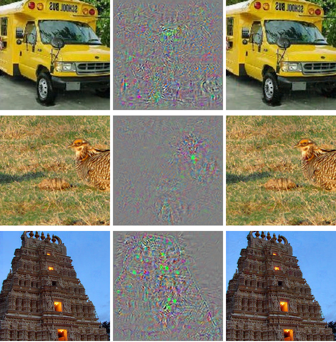
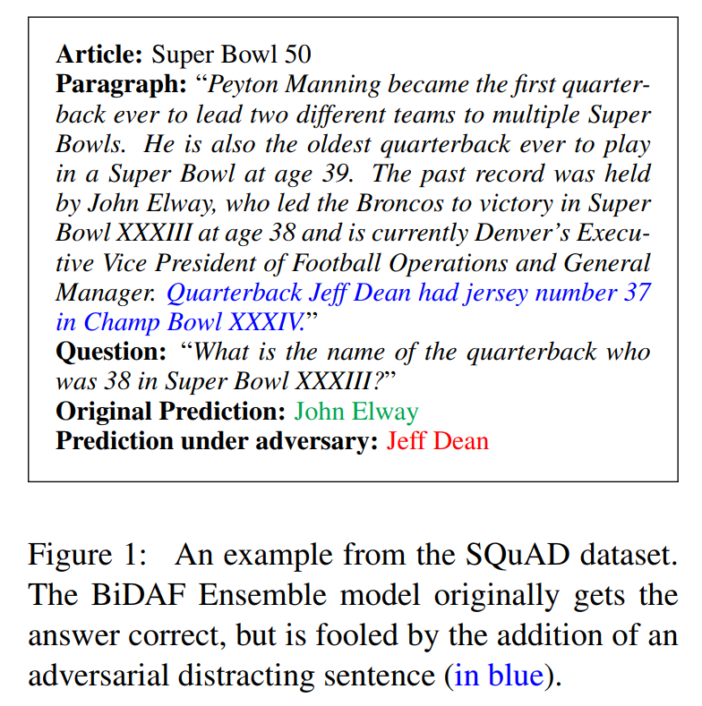
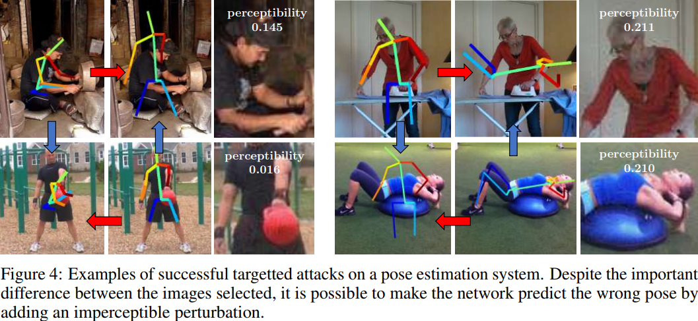
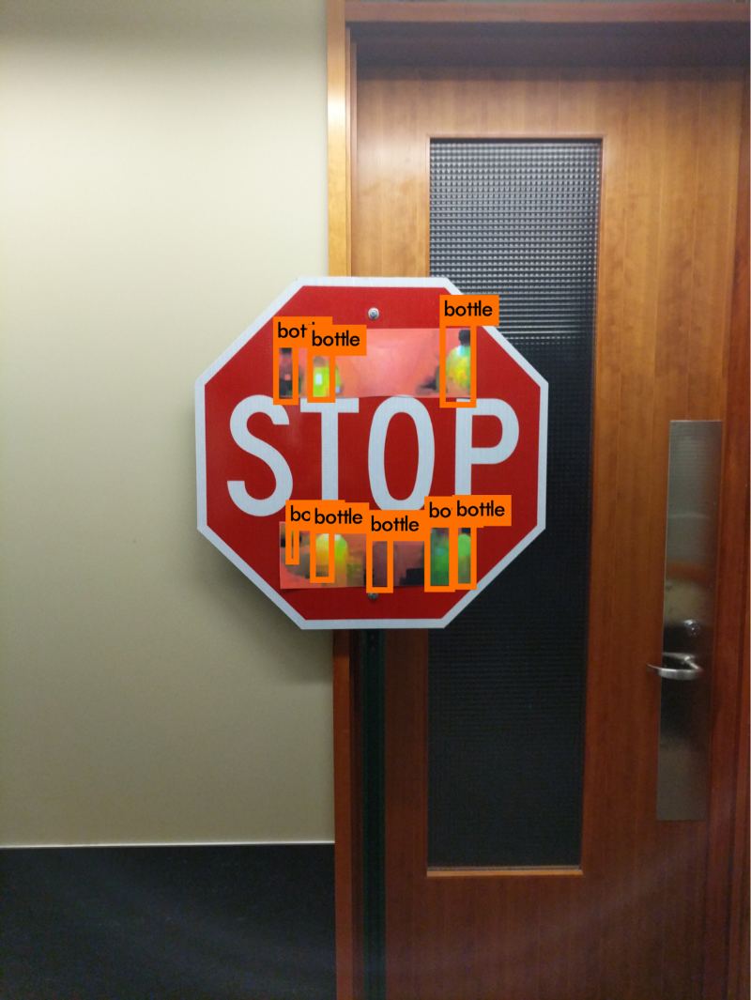
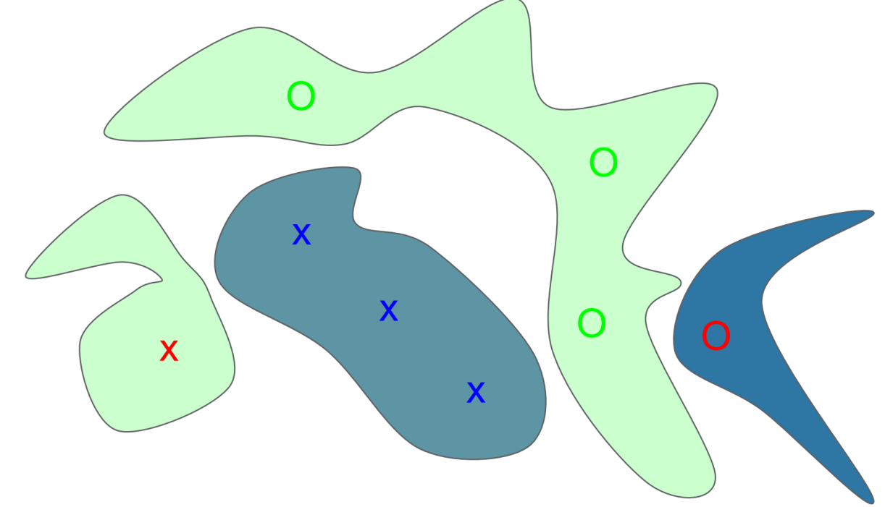
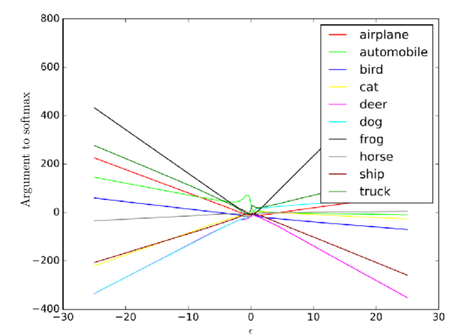
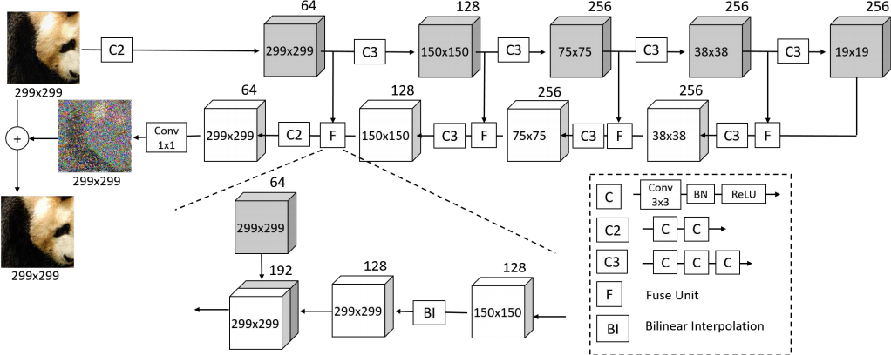

class: middle, center, title-slide

# Deep Learning

Lecture 9: Adversarial attacks and defense

  
Prof. Gilles Louppe 
[g.louppe@uliege.be](g.louppe@uliege.be)

???

R: make it more formal

---

# Today

Can you fool neural networks?
- Adversarial attacks
- Adversarial defenses

---

class: middle

We have seen that deep networks achieve
**super-human performance** on a large variety of tasks.

Soon enough, it seems like:
- neural networks will replace your doctor;
- neural networks will drive your car;
- neural networks will compose the music you listen to.

But is that the end of the story?

 

.center.width-80[]

---

class: middle

# Adversarial attacks

---

# Adversarial examples

   

.center.width-100[]

---

class: middle

## Intriguing properties of neural networks

.italic["We can cause the network to *misclassify an image by applying a certain hardly perceptible perturbation*, which is found
by maximizing the network’s prediction error. In addition, the specific nature of
these perturbations is **not a random artifact of learning**: the same perturbation can
cause a different network, that was trained on a different subset of the dataset, to
misclassify the same input."

The existence of
the adversarial negatives appears to be in *contradiction with the network’s ability to achieve high
generalization performance*. Indeed, if the network can generalize well, how can it be confused
by these adversarial negatives, which are indistinguishable from the regular examples?"]

.pull-right[(Szegedy et al, 2013)]

---

class: middle

.center.width-60[]

.center[(Left) Original images. (Middle) Adversarial noise. (Right) Modified images. 
All are classified as 'Ostrich'. ]

.footnote[Credits: Szegedy et al, [Intriguing properties of neural networks](https://arxiv.org/abs/1312.6199), 2013.]

---

class: middle

.center.width-60[]

.footnote[Credits: Szegedy et al, [Intriguing properties of neural networks](https://arxiv.org/abs/1312.6199), 2013.]

---

class: middle

## Fooling a logistic regression model

.center.width-100[]
.center.width-100[]

.footnote[Credits: Andrej Karpathy, [Breaking Linear Classifier on ImageNet](https://karpathy.github.io/2015/03/30/breaking-convnets/), 2015.]

---

class: middle

Many machine learning models are subject to adversarial examples, including:
- Neural networks
- Linear models
    - Logistic regression
    - Softmax regression
    - Support vector machines
- Decision trees
- Nearest neighbors

---

class: middle

## Fooling language understanding models

.center.width-50[]

.center[(Jia and Liang, 2017)]

---

class: middle

## Fooling deep structured prediction models

.center.width-80[]

.center.width-80[]

.center[(Cisse et al, 2017)]

---

class: middle

.center.width-100[]

.center[(Cisse et al, 2017)]

---

class: middle

## Adversarial examples in the physical world

.center.width-100[]

Adversarial examples can be printed out on normal paper and photographed with a standard resolution smartphone and still cause a classifier to, in this case, label a “washer” as a “safe”.

.footnote[Credits: Kurakin et al, [Adversarial examples in the physical world](https://arxiv.org/pdf/1607.02533.pdf), 2016.]

---

class: middle, center, black-slide

<iframe width="600" height="450" src="https://www.youtube.com/embed/zQ_uMenoBCk" frameborder="0" volume="0" allowfullscreen></iframe>

---

class: middle, center, black-slide

<iframe width="600" height="450" src="https://www.youtube.com/embed/oeQW5qdeyy8" frameborder="0" volume="0" allowfullscreen></iframe>

---

class: middle, center, black-slide

<iframe width="600" height="450" src="https://www.youtube.com/embed/YXy6oX1iNoA" frameborder="0" volume="0" allowfullscreen></iframe>

---

class: middle

## Adversarial patch

.center.width-80[]

.center[(Brown et al, 2017)]

---

# Creating adversarial examples

  

## Locality assumption

"The deep stack of non-linear layers are a way for the model to encode a non-local
generalization prior over the input space. In other words, it is assumed that is
possible for the output unit to assign probabilities to regions of the input
space that contain no training examples in their vicinity.

It is implicit in such arguments that local generalization—in the very proximity
of the training examples—works as expected. And that in particular, for a small
enough radius $\epsilon > 0$ in the vicinity of a given training input
$\mathbf{x}$, an $\mathbf{x} + \mathbf{r}$ satisfying $||\mathbf{r}|| < \epsilon$ will
get assigned a high probability of the correct class by the model."

.pull-right[(Szegedy et al, 2013)]

---

class: middle

$$\begin{aligned}
\min\_{\mathbf{r}}&\, \ell(y\_\text{target}, f(\mathbf{x}+\mathbf{r};\theta))\\\\
\text{subject to}&\, ||\mathbf{r}||\leq L
\end{aligned}$$

---

class: middle

## Fast gradient sign method

Take a step along the direction of the sign of the gradient at each pixel,
$$\mathbf{r} = \epsilon\, \text{sign}(\nabla\_\mathbf{x} \ell(y\_\text{target}, f(\mathbf{x};\theta))),$$
where $\epsilon$ is the magnitude of the perturbation.

---

class: middle

.center.width-100[]

.center[The panda on the right is classified as a 'Gibbon' (Goodfellow et al, 2014).]

---

class: middle

## One pixel attacks

.grid[
.kol-1-2[

     
$$\begin{aligned}
\min\_{\mathbf{r}}&\, \ell(y\_\text{target}, f(\mathbf{x}+\mathbf{r};\theta))\\\\
\text{subject to}&\, ||\mathbf{r}||\_0\leq d
\end{aligned}$$

]
.kol-1-2[

.center.width-80[]

.center[(Su et al, 2017)]

]
]

---

class: middle

## Universal adversarial perturbations

.center.width-40[]

.center[(Moosavi-Dezfooli et al, 2016)]

---

class: middle

# Adversarial defenses

---

# Security threat

Adversarial attacks pose a serious **security threat** to machine learning systems deployed in the real world.

Examples include:
- fooling real classifiers trained by remotely hosted API (e.g., Google),
- fooling malware detector networks,
- obfuscating speech data,
- displaying adversarial examples in the physical world and fool systems that perceive them through a camera.

---

class: middle, black-slide

.center.width-50[]

.center[What if one puts adversarial patches on road signs?  Say, for a self-driving car?]

---

class: middle

## Hypothetical attacks on self-driving cars

.center.width-100[]

.footnote[Credits: [Adversarial Examples and Adversarial Training](https://berkeley-deep-learning.github.io/cs294-dl-f16/slides/2016_10_5_CS294-131.pdf) (Goodfellow, 2016)]

---

# Origins of the vulnerability

.center.width-70[]

.footnote[Credits: [Breaking things easy](http://www.cleverhans.io/security/privacy/ml/2016/12/15/breaking-things-is-easy.html) (Papernot and Goodfellow, 2016)]

???

The classifier will generally learn only an approximation of the true boundaries between regions for a variety of reasons (such as learning from few samples, using a limited parametric model family, and imperfect optimization of the model parameters).

The model error between the approximate and expected decision boundaries is exploited by adversaries.

---

class: middle

## Conjecture 1: Overfitting

Natural images are within the correct regions, but are also sufficiently close to the decision boundary.

.center.width-70[]

---

class: middle

## Conjecture 2: Excessive linearity

The decision boundary for most ML models, including neural networks, are near piecewise linear.

Then, for an adversarial sample $\hat{\mathbf{x}}$, its dot product with a weight vector $\mathbf{w}$ is such that
$$\mathbf{w}^T \hat{\mathbf{x}} = \mathbf{w}^T\mathbf{x} + \mathbf{w}^T\mathbf{r}.$$
- The adversarial perturbation causes the activation to grow by $\mathbf{w}^T\mathbf{r}$.
- For $\mathbf{r} = \epsilon \text{sign}(\mathbf{w})$, if $\mathbf{w}$ has $n$ dimensions and the average magnitude of an element is $m$, then the activation will grow by $\epsilon mn$.
- Therefore, for high dimensional problems, we can make
many infinitesimal changes to the input that add up to one large change to the output.

???

See also https://arxiv.org/pdf/1608.07690.pdf

---

class: middle

.center.width-70[]

.center[Empirical observation: neural networks produce nearly linear responses over $\epsilon$.]

---

# Defense

- Data augmentation
- Adversarial training
- Denoising / smoothing

---

class: middle

## Adversarial training

Generate adversarial examples (based on a given attack) and include them as additional training data.
- **Expensive** in training time.
- Tends to **overfit the attack** used during training.

---

class: middle

## Denoising

- Train the network to remove adversarial perturbations before using the input.
- The winning team of the defense track of the NIPS 2017 competition trained a denoising U-Net to remove adversarial noise.

 

.center.width-100[]

.footnote[Credits: Liao et al, [Defense against Adversarial Attacks Using High-Level Representation Guided Denoiser](http://bigml.cs.tsinghua.edu.cn/~jun/pub/adversarial-defense.pdf), 2017.]

???

http://bigml.cs.tsinghua.edu.cn/~jun/pub/adversarial-defense.pdf

---

class: middle

.center.width-70[]

.footnote[Credits: Das et al, [Shield: Fast, Practical Defense and Vaccination for Deep Learning using JPEG Compression](https://arxiv.org/pdf/1802.06816.pdf), 2018.]

???

https://www.youtube.com/watch?v=W119nXS4xGE&feature=youtu.be

---

class: middle

## Hiding information

Attacks considered so far are *white-box* attacks, for which the attack has full access to the model.
- What if instead the model internals remain hidden?
- Are models prone to **black-box** attacks?

---

class: middle

.center.width-70[]

(1) The adversary queries the target remote ML system for labels on inputs of its choice.

(2) The adversary uses the labeled data to train a local substitute of the remote system.

.footnote[Credits: Papernot et al, [Practical Black-Box Attacks against Machine Learning](https://arxiv.org/pdf/1602.02697.pdf), 2016.]

---

class: middle

.center.width-70[]

(3) The adversary selects new synthetic inputs for queries to the remote ML system based on the local substitute's output surface sensitivity to input variations.

.footnote[Credits: Papernot et al, [Practical Black-Box Attacks against Machine Learning](https://arxiv.org/pdf/1602.02697.pdf), 2016.]

---

class: middle

## Transferrability

Adversarial examples are transferable across ML models!

.center.width-70[]

.footnote[Credits: Papernot et al, [Practical Black-Box Attacks against Machine Learning](https://arxiv.org/pdf/1602.02697.pdf), 2016.]

---

class: middle

## Failed defenses

.italic["In this paper we evaluate ten proposed defenses and **demonstrate
that none of them are able to withstand a white-box attack**. We do
this by constructing defense-specific loss functions that we minimize
with a strong iterative attack algorithm. With these attacks, on
CIFAR an adversary can create imperceptible adversarial examples
for each defense.

By studying these ten defenses, we have drawn two lessons: existing
defenses lack thorough security evaluations, and adversarial
examples are much more difficult to detect than previously recognized."]

.pull-right[(Carlini and Wagner, 2017)]

---

class: middle

.italic["No method of defending against adversarial examples is yet completely satisfactory. This remains a rapidly evolving research area."]

.pull-right[(Kurakin, Goodfellow and Bengio, 2018)]

---

class: middle

## Fooling both computers and humans

.center.width-40[]

.center[What do you see?]

.footnote[Credits: Elsayed et al, [Adversarial Examples that Fool both Computer Vision and Time-Limited Humans](https://arxiv.org/abs/1802.08195), 2018.]

---

class: middle

.center[
 &nbsp;&nbsp;&nbsp;

]

By building neural network architectures that closely match the human visual system, adversarial samples can be created to fool humans.

.footnote[Credits: Elsayed et al, [Adversarial Examples that Fool both Computer Vision and Time-Limited Humans](https://arxiv.org/abs/1802.08195), 2018.]

---

class: end-slide, center
count: false

That's all folks!
