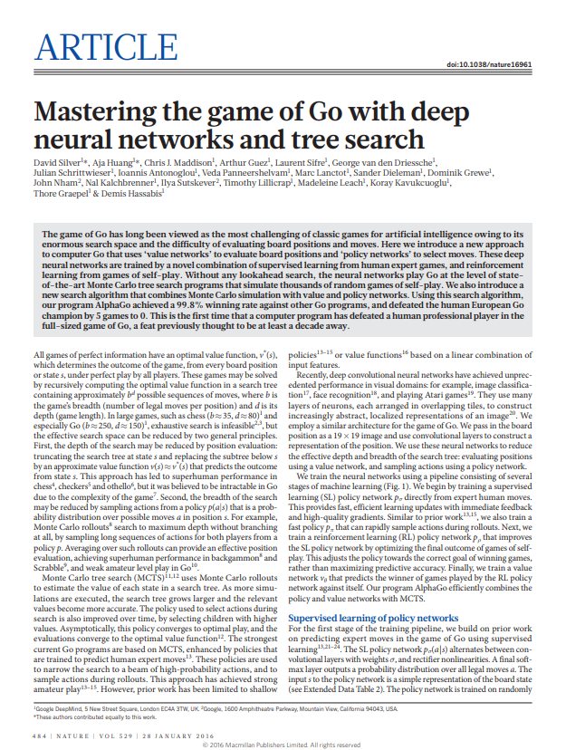

class: middle, center, title-slide

# Deep Learning

Spring 2019

  
Prof. Gilles Louppe 
[g.louppe@uliege.be](g.louppe@uliege.be)

???

https://www.cs.toronto.edu/~duvenaud/courses/csc2541/index.html projects

---

# Logistics

This course is given by:
- Theory: Prof. Gilles Louppe ([g.louppe@uliege.be](mailto:g.louppe@uliege.be))
- Projects and guidance:
    - Antoine Wehenkel ([antoine.wehenkel@uliege.be](antoine.wehenkel@uliege.be))
    - Joeri Hermans ([joeri.hermans@doct.uliege.be](mailto:joeri.hermans@doct.uliege.be))
    - Matthia Sabatelli ([m.sabatelli@uliege.be](mailto:m.sabatelli@uliege.be))

Feel free to contact any of us for help!

 

.center[
.circle[] &nbsp;
.circle[] &nbsp;
.circle[] &nbsp;
.circle[]
]

---

# Lectures

- Theoretical lectures
- Tutorials
- Q&A sessions

---

# Materials

Slides are available at [github.com/glouppe/info8010-deep-learning](https://github.com/glouppe/info8010-deep-learning).
- In HTML and in PDFs.
- Posted online the day before the lesson (hopefully).

Some lessons are partially adapted from "[EE-559 Deep Learning](https://fleuret.org/ee559)" by Francois Fleuret (EPFL).

.center.width-80[]

---

# Textbook

None!

---

# Philosophy

## Thorough and detailed
- Understand the landscape of deep learning.
- Be able to write from scratch, debug and run (some) deep learning algorithms.

## State-of-the-art
- Introduction to materials new from research ($\leq$ 5 years old).
- Understand some of the open questions and challenges in the field.

## Practical
- Fun and challenging course project.

---

# Outline

- Lecture 1: Fundamentals of machine learning
- Lecture 2: Neural networks
- Lecture 3: Convolutional neural networks
- Lecture 4: Training neural networks
- Lecture 5: Recurrent neural networks
- Lecture 6: Differentiable inference and generative models (part 1)
- Lecture 7: Differentiable inference and generative models (part 2)
- Lecture 8: Bayesian deep learning
- Lecture 9: Theory of deep learning
- Lecture 10: Applications

---

# Projects

## Reading assignment

Read, summarize and criticize a major scientific paper in Deep Learning.
(Paper to be announced later.)

.center.width-40[]

---

class: middle

## Programming project

TBD.

???

xxx

jetson

---

# Evaluation

- Exam (50%)
- Reading assignment (10%)
- Programming project (40%)

The reading assignment and the programming project are **mandatory** for presenting the exam.

---

class: end-slide, center
count: false

Let's start!
