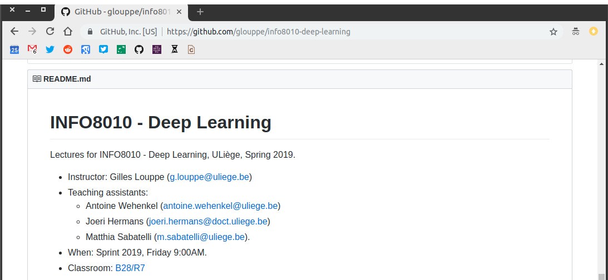

class: middle, center, title-slide

# Deep Learning

Spring 2019

  
Prof. Gilles Louppe 
[g.louppe@uliege.be](g.louppe@uliege.be)

???

https://www.cs.toronto.edu/~duvenaud/courses/csc2541/index.html projects

R: add one lecture on computer vision (segmentation, localization, tracking, etc) + NLP
R: add one lecture to better connect back to AI?
R: add one lecture on attention/transformer/other architectures?
https://jalammar.github.io/illustrated-transformer/
https://staff.fnwi.uva.nl/s.abnar/?p=108

---

# Logistics

This course is given by:
- Theory: Prof. Gilles Louppe ([g.louppe@uliege.be](mailto:g.louppe@uliege.be))
- Projects and guidance:
    - Joeri Hermans ([joeri.hermans@doct.uliege.be](mailto:joeri.hermans@doct.uliege.be))
    - Matthia Sabatelli ([m.sabatelli@uliege.be](mailto:m.sabatelli@uliege.be))
    - Antoine Wehenkel ([antoine.wehenkel@uliege.be](antoine.wehenkel@uliege.be))

Feel free to contact any of us for help!

 

.center[
.circle[] &nbsp;
.circle[] &nbsp;
.circle[] &nbsp;
.circle[]
]

---

# Lectures

- Theoretical lectures
- Tutorials
- Q&A sessions

---

# Materials

Slides are available at [github.com/glouppe/info8010-deep-learning](https://github.com/glouppe/info8010-deep-learning).
- In HTML and in PDFs.
- Posted online the day before the lesson (hopefully).

Some lessons are partially adapted from "[EE-559 Deep Learning](https://fleuret.org/ee559)" by Francois Fleuret at EPFL.

.center.width-80[]

---

# Textbook

None!

---

# Resources

- [Awesome Deep Learning](https://github.com/ChristosChristofidis/awesome-deep-learning)
- [Awesome Deep Learning papers](https://github.com/terryum/awesome-deep-learning-papers)

---

# AI at ULiège

This course is part of the many other courses available at ULiège and related to AI, including:

- INFO8006: Introduction to Artificial Intelligence
- ELEN0062: Introduction to Machine Learning
- **INFO8010: Deep Learning $\leftarrow$ you are there**
- INFO8003: Optimal decision making for complex problems
- INFO8004: Advanced Machine Learning
- INFO0948: Introduction to Intelligent Robotics
- INFO0049: Knowledge representation
- ELEN0016: Computer vision
- DROI8031: Introduction to the law of robots

---

# Outline

(Tentative and subject to change!)

- Lecture 1: Fundamentals of machine learning
- Lecture 2: Neural networks
- Lecture 3: Convolutional neural networks
- Lecture 4: Training neural networks
- Lecture 5: Recurrent neural networks
- Lecture 6: Auto-encoders and generative models
- Lecture 7: Generative adversarial networks
- Lecture 8: Uncertainty
- Lecture 9: Mysteries and frontiers

---

# Philosophy

## Thorough and detailed
- Understand the foundations and the landscape of deep learning.
- Be able to write from scratch, debug and run (some) deep learning algorithms.

## State-of-the-art
- Introduction to materials new from research ($\leq$ 5 years old).
- Understand some of the open questions and challenges in the field.

## Practical
- Fun and challenging course project.

---

# Projects

## Reading assignment

Read, summarize and criticize a major scientific paper in deep learning.

Pick one of the following three papers:

- He, K., Zhang, X., Ren, S., & Sun, J. (2016). Deep residual learning for image recognition. arXiv:[1512.03385](https://arxiv.org/abs/1512.03385).
- Andrychowicz, M., Denil, M., Gomez, S., Hoffman, M. W., Pfau, D., Schaul, T., ... & De Freitas, N. (2016). Learning to learn by gradient descent by gradient descent. arXiv:[1606.04474](https://arxiv.org/abs/1606.04474).
- Zhang, C., Bengio, S., Hardt, M., Recht, B., & Vinyals, O. (2016). Understanding deep learning requires rethinking generalization. arXiv:[1611.03530](https://arxiv.org/abs/1611.03530).

Deadline: **April 5, 2019 at 23:59**.

---

class: middle

## Project

Ambitious project of your choosing. Details to be announced soon.

---

# Evaluation

- Exam (50%)
- Reading assignment (10%)
- Project (40%)

The reading assignment and the project are **mandatory** for presenting the exam.

---

class: end-slide, center
count: false

Let's start!
